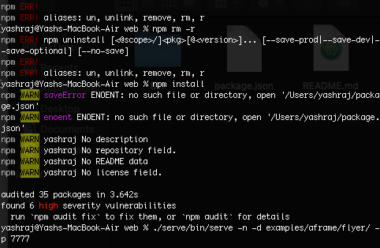

# WebAR Image Targets    
## Virtual prototyping for product development
  
Developing Virtual Reality based solutions in areas like: (i) Creating a virtual showcase/display centre of industrial products – developing solutions for one type of industry like garments, shoe industry etc. (Virtual prototyping for product development).   
Which is one of the two choices of assignment 2 you have.

# Jump In  
## What you will need: 
1. Most importantly watch this [Building Web AR experiences using 8th wall](https://youtu.be/9g4ynqrbyMM).   
2. To have a feel of what you are gonna be doing head to [8th wall jini](https://apps.8thwall.com/8w/jini/) on your mobile phones.  
3. Read this to know about what can be done using 8th wall and it's WebVR tendencies as written in [Medium](https://medium.com/8th-wall/if-you-can-webar-you-can-webvr-dbd658831f8c).     
4. Read some docs at [8th wall documentation](https://www.8thwall.com/docs/web/). Just as much as you can.     
5. Also what image target feature is and how it works is shown in [Medium](https://medium.com/8th-wall/release-11-image-targets-more-d53e4a3c12bc). 

Note: You'll need AR supported phones for each of the assignments.

# What exactly are we gonna make?  
Well the answer is simple enough... You can have any image taken from google and also a gltf 3D model from [Poly](http://poly.google.com) or any 3D model sites you know (Sketchfab, turbosquid etc)... Or just use one of the models I'll provide. So what we are gonna do is making the image the target for our model. What that will do is, as we place our camera over that image, the model loads up... One Example is this a Web AR by [Miller Lite](https://youtu.be/G-5ealr3Zi0). 

# Steps:
1. Firstly you'll need to make an account so head straight to [8th wall's official site](https://www.8thwall.com).  
2. Choose the option of Web Developer and make a new project, call it whatever you want to.
  
 
  
This is what it will look like when you have signed in and created a project..    
3. Click over your project and then click device authorization. You will have to scan the QR code through your mobile so your device gets authorized (web developer 'on').. Also, I recommend to connect your mobile phones and laptop/PC to the same wifi or use the mobile's hotspot in your laptops, so it's easier to connect and authorize incase it's not able to..   
  
  
  
This is what it looks like..
4. We will get back to this website again, for now go to [8th wall/web](https://github.com/8thwall/web). Open your command terminal and go to your Desktop (i.e. cd desktop). Enter ```git clone https://github.com/8thwall/web.git``` in your command line. You can now see a folder named web in your desktop.
5. Now ```cd web``` on your terminal and then   
```cd serve ```    
```npm install```     
```cd ..```     
```./serve/bin/serve -n -d examples/aframe/flyer/ -p 7777 ``` 
A QR code should appear in your command terminal (sometimes you have to resize the command terminal window for it to show properly). So far so good, if you get any errors in a section below I have written how to solve them.   
6. Now to establish a connection between the 8th wall project you just made and the web folder you downloaded... Go to your project at 8th wall, click over your project, click on settings on the left side (⚙️ Gear Emoji).. click on my app key and copy it... then in the web folder go to the directory ‘web/examples/aframe’, open the flyer example and click on index.html (use a text editor). On line 17, replace ‘XXXXX’ with the App Key that you copied.  
7. On your project of 8th wall, click on manage image targets... Go to ‘web/examples/aframe/flyer/targets’ and select ‘model-target.jpg’. Click on Upload. Finish by clicking on Save and tick load automatically.  
8. Now use your authorized phone, scan the code from your terminal  You might get a screen that says ‘Your connection is not private’. If so, click on Advanced at the bottom and then click on Proceed to http://192.168.43.198:7777.  
9. When you'll allow camera and scan that jellyfish modal-target.jpg ...You will get the same result as this [video](https://vimeo.com/417849499?utm_source=email&utm_medium=vimeo-cliptranscode-201504&utm_campaign=29220)... 
  
# Customization
Make your own customizations... By changing the model-target.jpg with any image you get from google and use your own gltf other that the regular jellyfish... Your task is developing solutions for one type of industry like garments, shoe industry, maybe coke... Like this [video I created](https://vimeo.com/user115354946/review/417852025/542b350d6a). The score for completion of the whole task is 100 points with 30 points in customization to something meaningful... Rest 70 points in achieving the jellyfish AR shown in step 9 above.
  
## Solving Errors
See that you are in serve folder only when you run ```npm install``` in your terminal. Still sometimes this bug appears
  

  
This is npm installation error which tells you to audit fix and says found 6(or more) high severity vulnerabilities...
Fix it by typing ```npm cache clean --force``` so if any log of files prevent installing npm, or there is unexpected end of JSON.. it can be fixed.. Also don't forget to ```cd ..``` to go back to web folder before starting the local server..
  
## Wrapping up  
Providing image recognition without the need of having an app and just scanning through a QR code leads to so many wonderful opportunities and brings context to the user when and where they need it. It can just be a shoe image scanning over which can load up a shoe model and it can make an effective commercial and probably the user will show interest and buy it... Hopefully these tasks will give you immense kneledge of webAR and 8th wall and most of you'll be able to complete them...  
   

